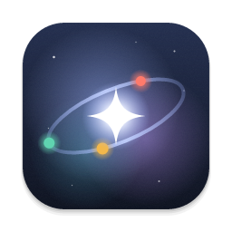
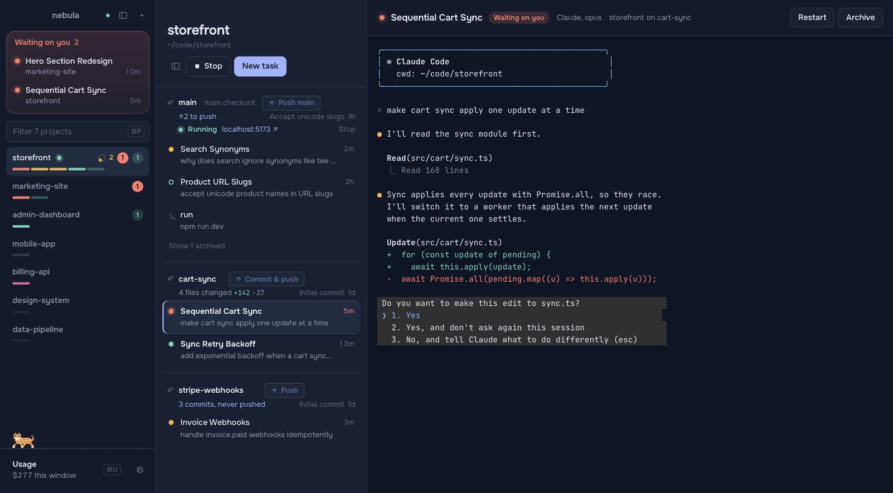
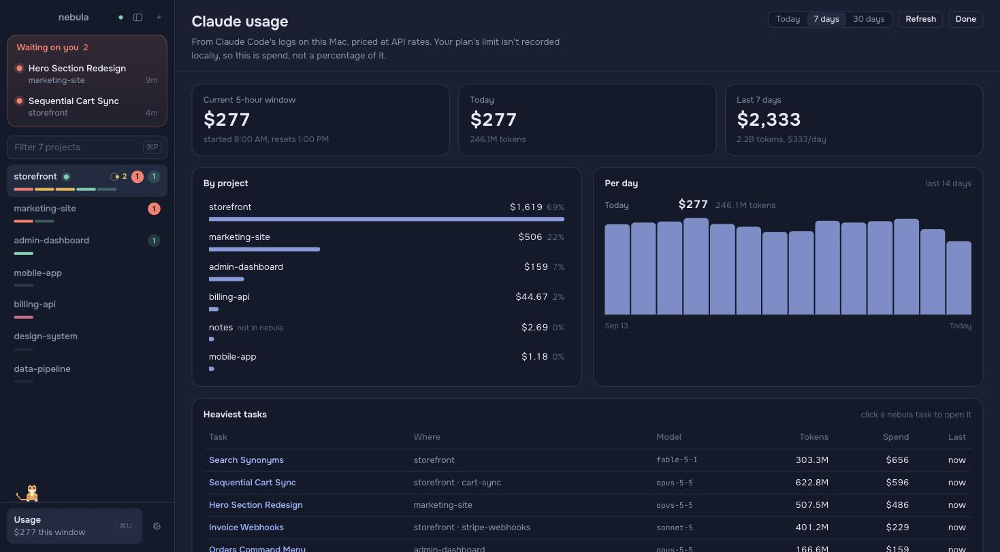
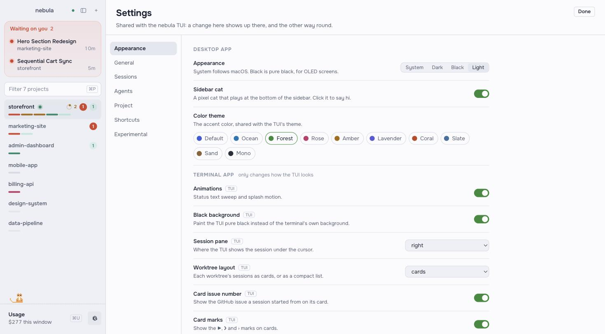

<p align="center">
  
</p>

<h1 align="center">Nebula Desktop</h1>

<p align="center">
  A macOS desktop client for <a href="https://github.com/AgentSystemLabs/nebula">nebula</a>, the
  daemon that runs your coding agents across a project's git worktrees.
</p>

It talks to the same daemon as the `nebula` TUI, so both can be open at once on the same sessions.
Close either one and your agents keep running.



## What it does

**Sessions**

- **Projects sidebar**: filter it with `⌘P` and jump with `⌘1`–`⌘9`. Each project shows one bar
  segment per session, a spinner with the number of tasks in progress, and badges for tasks waiting
  on you and finished ones you haven't read. `⌘O` adds a project from a folder, with the TUI's
  checks (already a project, missing folder, not a git repo).
- **Waiting on you**: every session blocked on a permission prompt or a question, across all
  projects. `⌘J` cycles through them, and you get a macOS notification and a dock badge.
- **Worktree bands**: sessions grouped by branch, with the ones that need you first. Switching
  projects brings back the session you last had open there.
- **Terminal**: attach to any agent or shell. Shift+Enter inserts a newline in Claude Code.
- **New task** (`⌘N`): on an existing branch or a new worktree (the branch name is suggested from
  the task), with your choice of agent and preset.

**Git and shipping**

- Each band shows where its branch stands: files changed with lines added and removed, commits to
  push, a branch that was never pushed, commits behind, merge conflicts, and a remote branch that's
  been deleted.
- **Commit & push**, **Push** or **Resolve** hands the job to an idle agent on that branch, or
  starts one. It waits while an agent there is still mid-turn, so nothing gets committed half-done.

**Running the project**

- **Start** runs the project's run command (the Project setting, or `run` in `.nebula.json`) in the
  worktree's run terminal. Once the dev server prints its address, the band shows it as a link.
- No run command yet? Type one, or ask an agent to work it out and write `.nebula.json`.

**Claude usage** (`⌘U`)



Read from Claude Code's own logs on your Mac and priced at API rates: the current 5-hour window,
today, 7 or 30 days, by project and by task, and day by day. Click a task to open it. Your plan's
limits aren't recorded locally, so this shows what you spent, not a percentage of your cap.

**Settings** (`⌘,`)



Every tab of the TUI's settings, written to the same files the same way, so a change in either
app shows up in the other. Rows that only affect the TUI's look are tagged. The color theme is
shared with the TUI; System, Dark, Black and Light are for the desktop app, and the terminal
follows them.

**And** resizable columns, and a pixel cat that plays at the bottom of the sidebar. It chases a
yarn ball, naps, and sits up when an agent starts waiting on you. Click it to say hi, or turn it
off in Settings.

## Running

```sh
npm install
npm run tauri dev      # against your real nebula daemon
npm run tauri build    # .app in src-tauri/target/release/bundle/macos
```

The app connects to the daemon the TUI uses (`nebula` starts it; the app offers to as well).

## Version pinning

The daemon only accepts clients built with its exact `PROTOCOL_VERSION`. `nebula-core` is pinned
by tag in `src-tauri/Cargo.toml`:

```toml
nebula-core = { git = "https://github.com/AgentSystemLabs/nebula", tag = "v0.40.2" }
```

After `nebula upgrade`, bump the tag and rebuild. If the protocol changed, `src/nebula/types.ts`
may need the same change; the e2e check below catches drift. On a mismatch the app shows a
"doesn't match" screen rather than misbehaving.

## Developing without touching your sessions

`scripts/sandbox.sh` runs a throwaway daemon with its own socket, database and settings, two demo
repos, and a fake agent CLI (`scripts/fake-agent.sh`) that fires nebula's status hooks instead of
calling a model. In a fake agent, type `ask …` to make it wait on you.

```sh
scripts/sandbox.sh app    # the app against the sandbox
scripts/sandbox.sh e2e    # protocol check: worktree, agent, attach, input, statuses
scripts/sandbox.sh stop
```

`npm run dev` on its own serves a browser preview with demo data and a canned terminal. It's
handy for styling, and needs no daemon. The screenshots above are from it.

## Layout

- `src-tauri/src/daemon.rs`: the socket connection. It forwards daemon events to the webview,
  with terminal output sent separately as base64.
- `src-tauri/src/git.rs`: a checkout's git state (the daemon doesn't report it).
- `src-tauri/src/usage.rs`: reads Claude Code's session logs incrementally into hourly buckets.
- `src-tauri/src/settings.rs`: writes nebula's settings the way the TUI does.
- `src/nebula/`: typed protocol mirror, store, client (request/Ack routing), notifications, and
  the git, usage, runs, settings and theme logic.
- `src/components/`: sidebar, sessions column, terminal pane, dialogs, usage and settings views,
  and the cat (`petBrain.ts` is its behavior, separate from the drawing).
- `src-tauri/icons/app-icon.svg`: the icon's source. Regenerate the set with
  `npx tauri icon src-tauri/icons/app-icon.svg`.
